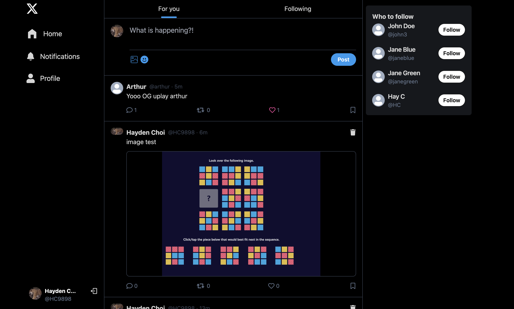
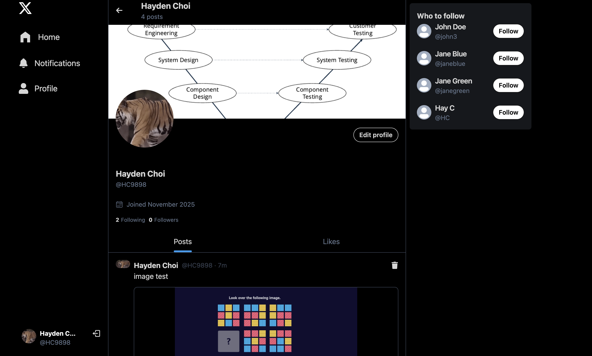
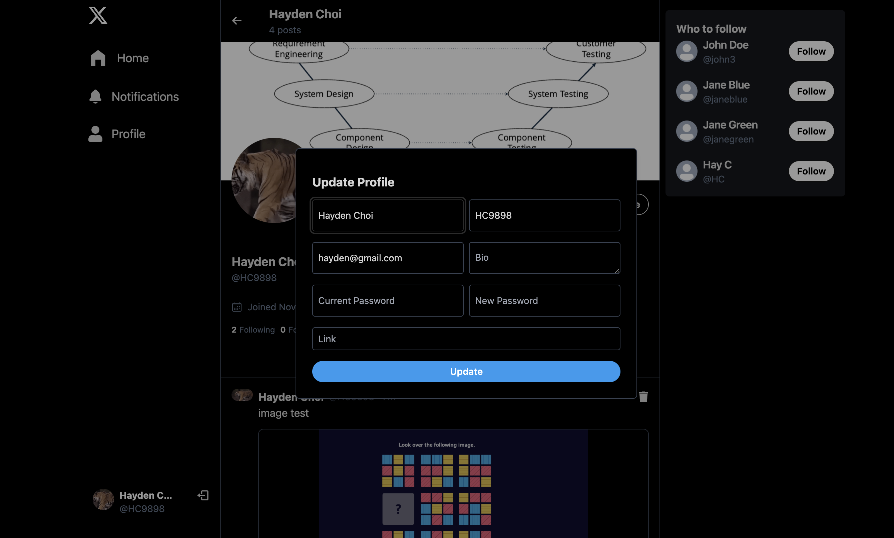
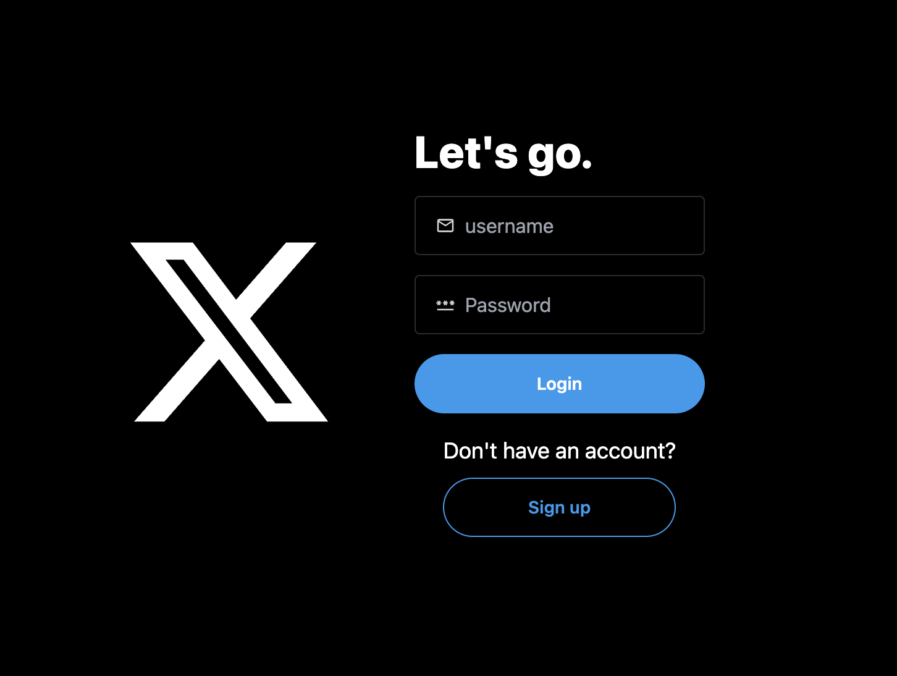

# 🕊️ X Clone – Full-Stack Social App  

A modern, full-stack clone of **X (formerly Twitter)** built to explore scalable app architecture, secure authentication, and real-time social features — all wrapped in a clean, responsive UI.  

🔗 **Live Demo:** [twitter-clone-e4vr.onrender.com](https://twitter-clone-e4vr.onrender.com/)  
🧠 Built with the **MERN stack** (MongoDB, Express, React, Node.js)  
🌐 Deployed on **Render**  

---

## ✨ Overview  

This project recreates the core experience of Twitter/X — from posting and following users to updating profiles and media uploads.  
It focuses on **modern web practices** like component-driven design, API caching, and authentication with JWTs.  

---

## 🧩 Features  

✅ **User Authentication** – Secure login/signup using JWT and bcrypt  
✅ **Create Posts** – Text or image posts with instant updates  
✅ **Follow System** – Follow/unfollow users and view personalized feeds  
✅ **Edit Profile** – Upload avatars, cover photos, and edit bio/link  
✅ **React Query Integration** – Full state and API caching support  
✅ **Responsive UI** – Built with TailwindCSS + DaisyUI for a sleek layout  
✅ **Image Uploads** – Integrated via Cloudinary  
✅ **Notifications Feed** – Real-time awareness for user activity  

---

## 🖼️ Screenshots  

| Home Feed | Profile | Edit Profile | Login |
|------------|----------|---------------|-------|
|  |  |  |  |

> *All screenshots captured from the live Render deployment.*  

---

## 🛠️ Tech Stack  

**Frontend:**  
- React.js (Vite)  
- React Router DOM  
- TailwindCSS + DaisyUI  
- React Icons  
- React Query/Tanstack

**Backend:**  
- Node.js + Express.js  
- MongoDB + Mongoose  
- JWT (jsonwebtoken)  
- bcryptjs  
- Cloudinary  
- Cookie-parser, CORS, dotenv  

**Dev Tools:**  
- Nodemon  
- Render (Deployment)  
- Postman for API testing  

---

## ⚙️ Installation & Setup  

**1️⃣ Clone the repository**  
git clone https://github.com/your-username/twitter-clone.git  
cd twitter-clone  

**2️⃣ Install dependencies**  
npm install  

**3️⃣ Start backend (development)**  
npm run dev  

**4️⃣ Start frontend**  
cd frontend  
npm install  
npm run dev  

> 🧾 **Environment Variables Required:**  
> - `MONGO_URI` – MongoDB connection string  
> - `JWT_SECRET` – JWT secret key for authentication  
> - `CLOUDINARY_URL` – Cloudinary API configuration  

---

## 🚧 Coming Soon  
📱 **Mobile Compatibility Enhancements** – Improved responsiveness, Apple Photos (HEIC) upload support  
💬 **Emoji Bar for Posts** – React with emojis directly on posts  
🔁 **Post Sharing / Reposting** – Bring retweet-style interactions  
🤖 **Grok-Style AI Replies** – Generate witty, context-aware AI responses  
🔒 **2FA (Two-Factor Authentication)** – Secure user verification  
🧑‍💼 **Admin Dashboard** – Manage reports and moderate users  
🧠 **Password Reset Flow** – Email-based password recovery  
📊 **Analytics Dashboard** – Engagement and post tracking  

---

## 📦 Project Structure  

📁 backend  
┣ server.js  
┣ routes/  
┣ controllers/  
┣ models/  
┗ middleware/  

📁 frontend  
┣ src/  
┃ ┣ components/  
┃ ┣ pages/  
┃ ┣ hooks/  
┃ ┣ utils/  
┗ package.json  

---

## 🧠 What I Learned  

- How to structure a full-stack application for scalability  
- Managing API state and caching with React Query  
- Uploading and optimizing media through Cloudinary  
- Handling authentication and protected routes using JWT  
- Designing responsive, modern UIs with TailwindCSS and DaisyUI  

---

## 💭 Coming Soon Thought  

> Building this clone taught me that scalability and polish go hand-in-hand — every new feature adds not just functionality, but personality.  
> The goal isn’t just to replicate X — it’s to **reimagine** it, one feature at a time.  
